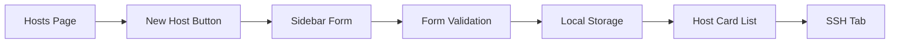
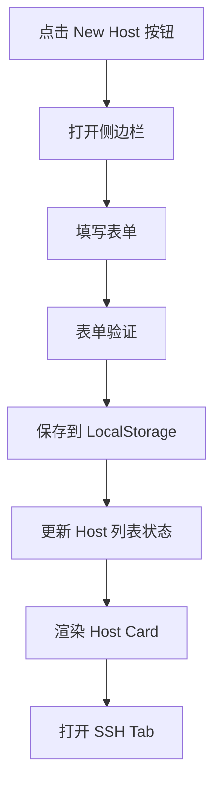

## Product Overview

修改现有 Hosts 页面，新增 "New Host" 按钮功能。点击按钮后，从页面右侧滑出侧边栏表单，用户可输入主机连接信息。提交后在页面展示 Host Card，并自动打开对应的 SSH Tab。本次仅实现前端 UI 部分，SSH 实际连接逻辑后续实现。

## Core Features

- **New Host 按钮**: 在 Hosts 页面顶部添加醒目的新建按钮
- **右侧滑出侧边栏表单**: 包含以下字段：
- Address（主机地址）
- Port（端口，默认 22）
- 认证方式切换：用户名+密码 或 用户名+SSH私钥内容
- **Host Card 展示**: 表单提交后，在页面以卡片形式展示已添加的主机信息
- **SSH Tab 联动**: 添加主机后自动打开对应的 SSH Tab
- **本地持久化存储**: Host 数据保存到本地存储，刷新页面后数据不丢失

## Tech Stack

基于现有项目技术栈进行开发，需先探索项目结构确定具体技术方案。

## Tech Architecture

### System Architecture

遵循现有项目架构模式，在 Hosts 页面模块中新增侧边栏组件和表单逻辑。



### Module Division

- **Sidebar 组件**: 右侧滑出的侧边栏容器，支持动画效果
- **NewHostForm 组件**: 主机信息表单，包含地址、端口、认证方式切换
- **HostCard 组件**: 展示单个主机信息的卡片（复用或扩展现有组件）
- **本地存储服务**: 封装 localStorage 操作，管理 Host 数据的增删改查

### Data Flow



## Implementation Details

### Core Directory Structure

根据项目探索结果，预计修改或新增以下文件：

```
src/
├── components/
│   ├── Sidebar/
│   │   └── NewHostSidebar.tsx    # 新增：右侧滑出侧边栏
│   └── Forms/
│       └── NewHostForm.tsx       # 新增：主机表单组件
├── pages/
│   └── Hosts/
│       └── index.tsx             # 修改：添加按钮和侧边栏集成
├── services/
│   └── hostStorage.ts            # 新增：本地存储服务
└── types/
    └── host.ts                   # 新增或修改：Host 类型定义
```

### Key Code Structures

**Host 数据接口**: 定义主机连接信息的数据结构，支持两种认证方式。

```typescript
interface HostData {
  id: string;
  name: string;
  address: string;
  port: number;
  authType: 'password' | 'privateKey';
  username: string;
  password?: string;
  privateKey?: string;
  createdAt: Date;
}
```

**本地存储服务接口**: 提供 Host 数据的持久化操作。

```typescript
class HostStorageService {
  getHosts(): HostData[];
  addHost(host: HostData): void;
  removeHost(id: string): void;
  updateHost(id: string, data: Partial<HostData>): void;
}
```

### Technical Implementation Plan

1. **侧边栏组件实现**

- 使用 CSS transform 实现右侧滑入动画
- 支持点击遮罩层或关闭按钮关闭侧边栏

2. **表单验证逻辑**

- Address 必填，支持 IP 或域名格式
- Port 必填，范围 1-65535
- 根据认证方式动态显示密码或私钥输入框

3. **本地存储集成**

- 使用 localStorage 存储 JSON 序列化的 Host 数组
- 页面加载时自动读取并恢复数据

## Design Style

采用现代简洁的设计风格，侧边栏从右侧平滑滑入，表单布局清晰，交互反馈及时。整体风格与现有 Hosts 页面保持一致。

## Page Design

### Hosts 页面修改

- **顶部区域**: 新增 "New Host" 按钮，使用主色调，带有加号图标
- **Host Card 列表**: 保持现有卡片布局，新增主机后实时更新

### New Host 侧边栏

- **侧边栏容器**: 宽度约 400px，从右侧滑入，带有半透明遮罩背景
- **表单头部**: 标题 "Add New Host"，右上角关闭按钮
- **表单内容区**:
- Address 输入框（带 placeholder 提示）
- Port 输入框（默认值 22）
- 认证方式切换（Tab 或 Radio 切换密码/私钥模式）
- Username 输入框
- Password 输入框（密码模式）或 Private Key 多行文本框（私钥模式）
- **表单底部**: Cancel 和 Connect 按钮

## Agent Extensions

### SubAgent

- **code-explorer**
- Purpose: 探索现有项目结构，了解 Hosts 页面当前实现、组件组织方式、样式方案和状态管理模式
- Expected outcome: 获取项目技术栈详情、现有组件结构、样式规范，确保新增代码与现有架构一致