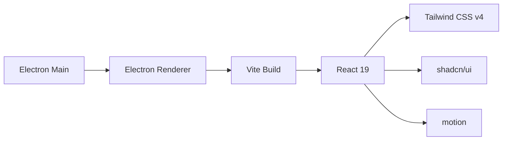

## Product Overview

为现有的 Electron + Vite + React 19 项目配置现代化的 UI 开发环境，包括 Tailwind CSS v4 样式框架、shadcn/ui 组件库和 motion (framer-motion) 动画库。

## Core Features

- 安装并配置 Tailwind CSS v4，支持 Vite 构建环境
- 集成 shadcn/ui 组件库，提供可复用的 UI 组件
- 安装 motion (framer-motion) 动画库，支持流畅的动画效果
- 确保所有依赖与 Electron + Vite + React 19 环境兼容

## Tech Stack

- 样式框架：Tailwind CSS v4 + @tailwindcss/vite 插件
- 组件库：shadcn/ui (基于 Radix UI)
- 动画库：motion (framer-motion)
- 构建工具：electron-vite + Vite

## Tech Architecture

### 系统架构

项目采用 electron-vite 构建，renderer 进程使用 React 19。需要在 renderer 部分集成样式和组件系统。



### 模块划分

- **Tailwind CSS 模块**：样式系统核心，通过 @tailwindcss/vite 插件集成
- **shadcn/ui 模块**：可复用组件库，依赖 Tailwind CSS
- **motion 模块**：动画库，独立安装配置

### 数据流

Vite 构建 → Tailwind CSS 处理样式 → React 组件渲染 → motion 动画效果

## Implementation Details

### 核心目录结构

```
project-root/
├── src/
│   └── renderer/
│       ├── src/
│       │   ├── components/
│       │   │   └── ui/          # shadcn/ui 组件目录
│       │   ├── lib/
│       │   │   └── utils.ts     # cn() 工具函数
│       │   ├── index.css        # Tailwind CSS 入口
│       │   └── App.tsx
│       └── index.html
├── components.json              # shadcn/ui 配置
├── tailwind.config.js           # Tailwind 配置 (如需)
└── package.json
```

### 关键配置结构

**Tailwind CSS v4 入口配置**：在 CSS 文件中使用 @import 引入 Tailwind

```css
/* src/renderer/src/index.css */
@import "tailwindcss";
```

**Vite 插件配置**：在 renderer 的 vite 配置中添加 Tailwind 插件

```typescript
// electron.vite.config.ts
import tailwindcss from '@tailwindcss/vite'

export default {
  renderer: {
    plugins: [react(), tailwindcss()]
  }
}
```

**shadcn/ui 工具函数**：提供 className 合并工具

```typescript
// src/renderer/src/lib/utils.ts
import { clsx, type ClassValue } from "clsx"
import { twMerge } from "tailwind-merge"

export function cn(...inputs: ClassValue[]) {
  return twMerge(clsx(inputs))
}
```

### 技术实现方案

1. **Tailwind CSS v4 安装**

- 安装 tailwindcss 和 @tailwindcss/vite
- 配置 Vite 插件
- 创建 CSS 入口文件

2. **shadcn/ui 集成**

- 安装依赖：clsx、tailwind-merge、class-variance-authority
- 初始化 shadcn 配置
- 配置组件路径别名

3. **motion 安装**

- 直接安装 motion 包
- 无需额外配置

### 集成要点

- Tailwind CSS v4 使用新的 @tailwindcss/vite 插件，无需 postcss 配置
- shadcn/ui 需要配置 TypeScript 路径别名以正确解析组件
- 确保 electron-vite 的 renderer 配置正确加载所有插件

## Agent Extensions

### SubAgent

- **code-explorer**
- Purpose：探索当前项目结构，了解 electron-vite 配置文件位置和现有配置
- Expected outcome：获取 electron.vite.config.ts、tsconfig.json、package.json 等关键文件的路径和内容结构