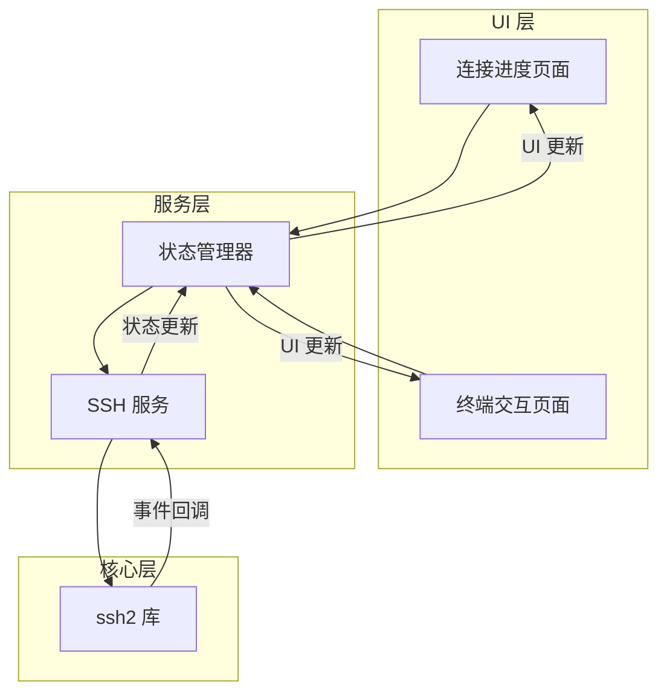
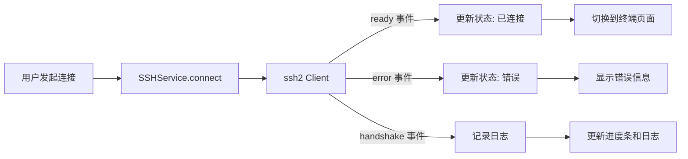

## 产品概述

基于 ssh2 库实现完整的 SSH 模块，提供连接进度展示、状态管理和终端交互功能。用户在建立 SSH 连接时能够实时查看连接状态、认证步骤日志，并在连接成功后进入终端交互界面。

## 核心功能

- **SSH 连接管理**：使用 ssh2 库建立 SSH 连接，支持密码认证和密钥认证
- **连接进度展示**：显示主机信息、连接进度条、认证步骤日志（如截图所示样式）
- **状态管理**：管理连接状态（连接中、已连接、断开、错误），实时更新 UI
- **终端交互**：连接成功后提供完整的终端交互功能
- **操作控制**：提供 Close 和 Start over 按钮，支持关闭连接和重新连接

## 技术栈

- **SSH 库**：ssh2（Node.js 原生 SSH 实现）
- **前端框架**：基于现有项目架构（Electron + React + TypeScript）
- **状态管理**：React 状态管理 + 事件驱动
- **终端渲染**：xterm.js（如项目已有）

## 技术架构

### 系统架构



### 模块划分

- **SSHService 模块**：封装 ssh2 库，处理连接、认证、会话管理
- **状态管理模块**：管理连接状态、日志记录、进度追踪
- **连接进度 UI 模块**：展示连接状态、进度条、日志列表
- **终端交互模块**：集成 xterm.js，处理终端输入输出

### 数据流



## 实现细节

### 核心目录结构

```
src/
├── services/
│   └── ssh/
│       ├── SSHService.ts      # SSH 连接服务
│       ├── SSHState.ts        # 状态类型定义
│       └── index.ts           # 模块导出
├── components/
│   └── ssh/
│       ├── SSHConnecting.tsx  # 连接进度页面
│       ├── SSHTerminal.tsx    # 终端交互组件
│       └── ConnectionLog.tsx  # 连接日志组件
└── hooks/
    └── useSSHConnection.ts    # SSH 连接 Hook
```

### 关键代码结构

**SSH 连接状态类型**：定义连接过程中的各种状态和日志结构

```typescript
interface SSHConnectionState {
  status: 'idle' | 'connecting' | 'authenticating' | 'connected' | 'error' | 'disconnected';
  progress: number;
  logs: ConnectionLog[];
  error?: string;
  hostInfo: {
    host: string;
    port: number;
    username: string;
  };
}

interface ConnectionLog {
  timestamp: Date;
  type: 'info' | 'success' | 'error' | 'warning';
  message: string;
  icon?: string;
}
```

**SSHService 核心接口**：封装 ssh2 库的连接和会话管理

```typescript
class SSHService {
  connect(config: SSHConfig): Promise<void>;
  disconnect(): void;
  createShell(): Promise<ClientChannel>;
  onStateChange(callback: (state: SSHConnectionState) => void): void;
  onLog(callback: (log: ConnectionLog) => void): void;
}
```

### 技术实现要点

1. **连接进度追踪**

- 监听 ssh2 的 ready、error、keyboard-interactive 等事件
- 将事件转换为用户可读的日志信息
- 根据认证阶段更新进度条

2. **状态管理**

- 使用事件驱动模式，SSHService 发出状态变更事件
- React 组件通过 Hook 订阅状态变化
- 支持连接重试和取消操作

3. **终端集成**

- 连接成功后创建 shell 会话
- 将 shell 数据流绑定到 xterm.js
- 处理终端 resize 事件

## 设计风格

参考截图样式，采用简洁现代的设计风格。连接进度页面居中展示，包含主机信息卡片、进度条、连接日志列表和操作按钮。

## 页面设计

### 连接进度页面

- **顶部区域**：显示主机图标、IP 地址、SSH 连接信息，右侧 Hide/Show logs 切换按钮
- **进度条区域**：水平进度条，左侧连接图标，右侧终端图标，显示当前连接进度
- **日志区域**：滚动日志列表，每条日志带图标和时间戳，显示认证方法、认证步骤、执行命令等
- **底部按钮**：Close 按钮（灰色）和 Start over 按钮（蓝色主色）

### 视觉效果

- 浅灰色背景，白色内容卡片
- 进度条使用渐变蓝色
- 日志文字使用等宽字体，便于阅读技术信息
- 按钮圆角设计，hover 状态有微交互

## Agent Extensions

### SubAgent

- **code-explorer**
- 用途：探索现有项目结构，了解当前 SSH 相关代码实现、状态管理模式和组件架构
- 预期结果：获取项目现有架构信息，确保新模块与现有代码风格一致